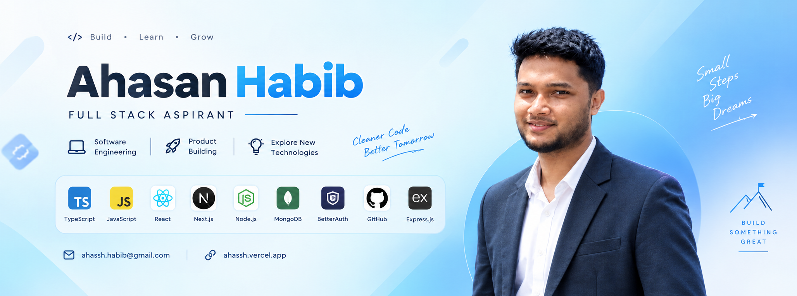

<!-- ======================= BANNER ======================= -->

  

<!-- ======================= INTRO ======================= -->

<h1 align="center">Hi 👋, I'm Ahasan Habib Polash</h1>

<h3 align="center">
  Full-Stack Developer • Product Builder • Aspiring Software Engineer
</h3>

  <i>Building with curiosity, solving with structure, and learning every day.</i>

---

<!-- ======================= ABOUT ME ======================= -->

## 👨‍💻 About Me

I'm **Ahasan Habib Polash**, a passionate Full-Stack Developer, product builder, and aspiring Software Engineer.

I enjoy breaking complex problems into smaller, meaningful steps and turning ideas into practical digital products. I care about writing **clean, organized, maintainable code** and keeping projects structured as they grow.

My interests go beyond just writing code. I enjoy exploring:

- 🧩 Problem solving & structured thinking
- 🏗️ Software architecture & system design
- 🎨 User experience & accessibility
- 🧹 Clean and maintainable code
- 🚀 Product development
- 🤝 Professional collaboration
- 🌱 Exploring new technologies

---

<!-- ======================= CURRENT FOCUS ======================= -->

## 🚀 What I'm Currently Doing

- 🔭 Building projects with **Next.js & Node.js**
- 🌱 Improving my skills in **MongoDB, TypeScript & Backend Development**
- 🧩 Exploring **System Design & Software Engineering**
- 🤝 Interested in collaborating on **Full-Stack & DevOps-related projects**
- 🛠️ Building practical projects to improve my development workflow

---

<!-- ======================= FUTURE LEARNING ======================= -->

## 🔮 Technologies I Want to Explore

I'm continuously expanding my backend and infrastructure knowledge.

**Future Learning:**

`Laravel` • `MySQL` • `PostgreSQL` • `Docker` • `Kubernetes` • `GraphQL`

---

<!-- ======================= TECH STACK ======================= -->

## 🛠️ Languages & Technologies

### 💻 Languages

  

  

  

  

  

  

### ⚛️ Frontend

  

  

  

  

  

### ⚙️ Backend & Database

  

  

  

  

  

  

### 🔐 Authentication & Tools

  

  

  

  

  

### ☁️ Exploring

  

---

<!-- ======================= CONNECT ======================= -->

## 🌐 Connect With Me

📧 **Email:** [ahassh.habib@gmail.com](mailto:ahassh.habib@gmail.com)

🌐 **Portfolio:** [ahassh.vercel.app](https://ahassh.vercel.app)

---

<!-- ======================= GITHUB STATS ======================= -->

## 📊 GitHub Overview

  

  

  

---

<!-- ======================= CONTRIBUTION SNAKE ======================= -->

## 🐍 Contribution Snake

  <picture>
    <source
      media="(prefers-color-scheme: dark)"
      srcset="https://raw.githubusercontent.com/ahassh1/ahassh1/output/github-snake-dark.svg"
    />

    <source
      media="(prefers-color-scheme: light)"
      srcset="https://raw.githubusercontent.com/ahassh1/ahassh1/output/github-snake.svg"
    />

    
  </picture>

---

<!-- ======================= PHILOSOPHY ======================= -->

## 💭 Developer Philosophy

> **Think small. Build clean. Learn continuously.**

I believe great software is not only about making things work —
it's about making them **understandable, maintainable, accessible, and useful**.

---

  <b>Thanks for visiting my profile! 🚀</b>

  <i>Let's build something meaningful.</i>

